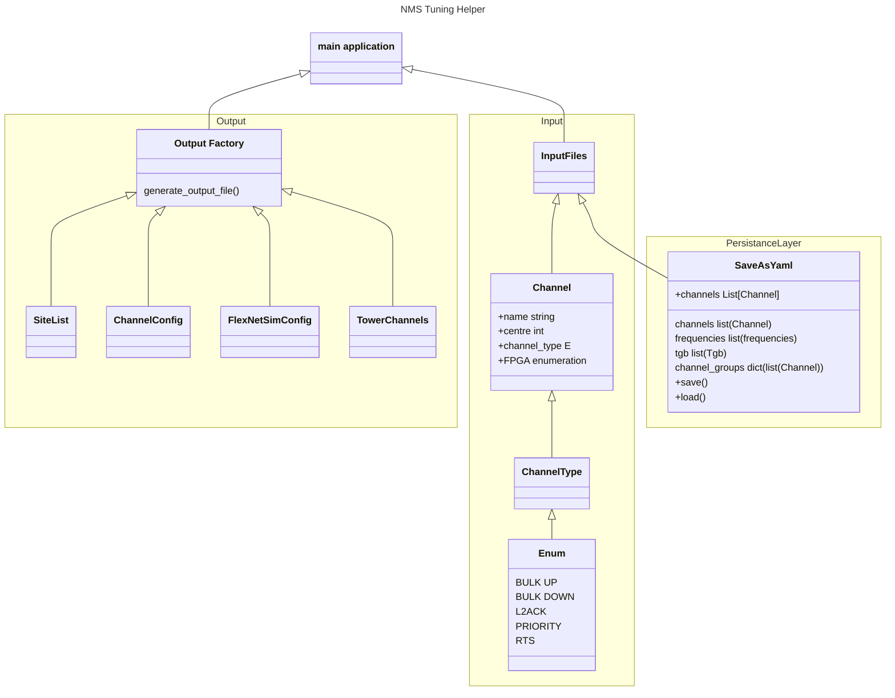

```mermaid
---
    title: NMS Tuning Helper
---
classDiagram
    class APP["main application"]
    class OutputFactory["Output Factory"]
    
    APP <|-- OutputFactory
    OutputFactory <|-- SiteList
    OutputFactory <|-- ChannelConfig
    OutputFactory <|-- FlexNetSimConfig
    OutputFactory <|-- TowerChannels

    namespace Output{
        class OutputFactory{
            generate_output_file()
        }
        class SiteList{
        }
        class ChannelConfig{
        }
        class FlexNetSimConfig{
        }
        class TowerChannels{
        }

    }
    APP <|-- InputFiles
    Channel <|-- ChannelType
    ChannelType <|-- Enum 
    InputFiles <|-- SaveAsYaml
    InputFiles <|-- Channel
    namespace Input{
        class InputFiles{
        }
        class Enum{
        BULK UP 
        BULK DOWN 
        L2ACK
        PRIORITY 
        RTS
    }
        class SaveAsYaml{
            +channels List[Channel]
        }
        class Channel{
            +name string
            +centre int
            +channel_type E
            +FPGA enumeration
            
        }
        class ChannelType{
        }
    }

    namespace PersistanceLayer {
        class SaveAsYaml {
            channels list(Channel)
            frequencies list(frequencies)
            tgb list(Tgb)
            channel_groups dict(list(Channel))
            
            
            +save()
            +load()
}
            
            
        
    }
```