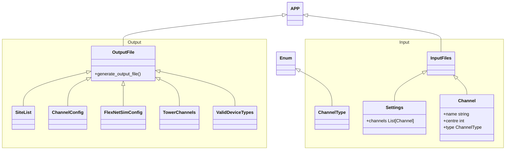

```mermaid
classDiagram
    APP <|-- OutputFile
    OutputFile <|-- SiteList
    OutputFile <|-- ChannelConfig
    OutputFile <|-- FlexNetSimConfig
    OutputFile <|-- TowerChannels
    OutputFile <|-- ValidDeviceTypes
    class APP{
    }
    class Enum{
    }
    namespace Output{
        class OutputFile{
            +generate_output_file()
        }
        class SiteList{
        }
        class ChannelConfig{
        }
        class FlexNetSimConfig{
        }
        class TowerChannels{
        }
        class ValidDeviceTypes{
        }
    }
    APP <|-- InputFiles
    Enum <|-- ChannelType
    InputFiles <|-- Settings
    InputFiles <|-- Channel
    namespace Input{
        class InputFiles{
        }
        class Settings{
            +channels List[Channel]
        }
        class Channel{
            +name string
            +centre int
            +type ChannelType
        }
        class ChannelType{
        }
    }
```